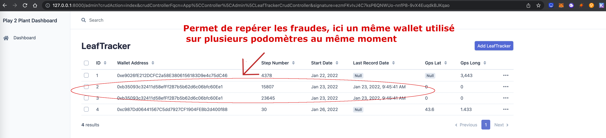
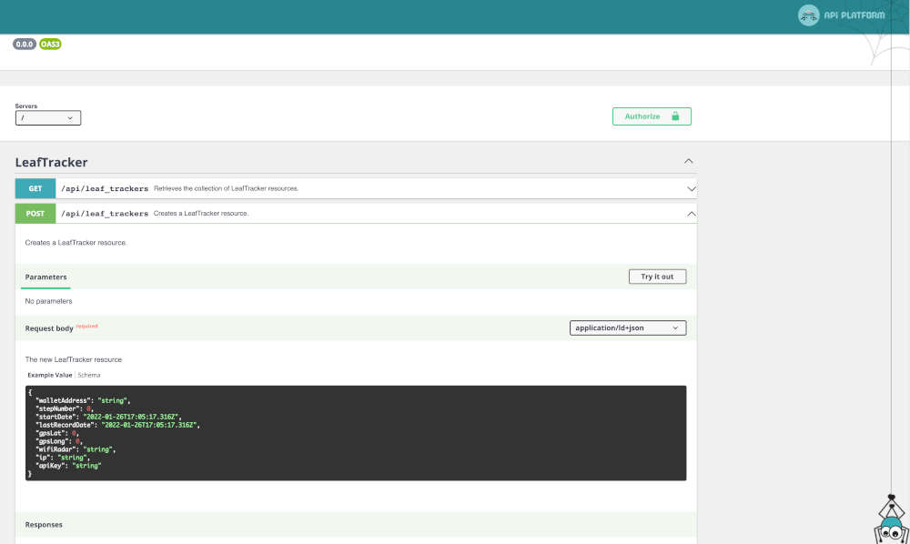

# 🍃 Play 2 Plant BackOffice

## Présentation
* Backoffice for Play 2 plant, track pedometer information for security and anti cheat solution

## 🔧 Installation

### Build with symfony :

* Get the code:

`git clone https://github.com/Play2Plant/backend-php.git`

* Installation PHP packages dependencies:

`composer install`

## 🔧 Copy and Configure .env.local file with your database credentials and port

`cp .env .env.local`

## 🔧 Create table
Start your mysql server and run :    

`bin/console doctrine:migrations:migrate`

## 🚀 Start App
```
symfony serve
```

## In localhost env :
    Admin on http://127.0.0.1:8000/admin    



    JSON API http://127.0.0.1:8000/api    



## 📜 Deploy

[Play 2 Plant dApp](https://play2plant.github.io/p2p-dApp/)

## 

## 📝 License

The Leaf project and tools uses the [MIT license](https://github.com/Play2Plant/leaf-website/blob/main/LICENSE)
